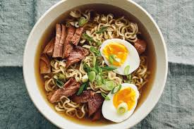

# SLURP SF: Your crowdsourced ramen guide to San Francisco!

<https://floating-reef-39049.herokuapp.com/>

The goal of this project is for users to discover new ramen restaurants in San Francisco. Each restaurant is listed in our directory according to the neighborhood it's located in.

Users are able to input their own favorite ramen restaurants. For any restaurant listing, users can also post any food recommendations they have to offer (we call these recommendations "slurps" :wink:).

## Technologies Used

**Server Side:**
- NodeJS & Express
- MongoDB & Mongoose
- Heroku

**Client Side:**
- HTML
- CSS
- Bootstrap
- JavaScript
- JQuery
- JSON

## Existing Features

- Users are able to input their favorite ramen restaurants
- Users are able to input their 'slurps' (recommendations) for any existing restaurant

## Planned Features
- We would like to integrate Google Maps API to our webpage that incorporates color-coded neighborhoods of San Francisco, as well as markers pinpointing each restaurant. This will allow users to see the locations of different neighborhoods and restaurants altogether on a map.
- We would like to incorporate password-protection for our users, perhaps logging in through their Yelp, Facebook, or Google account.
- We would like to incorporate a voting system for favorite ramen restaurants. Users can upvote or downvote a restaurant in the directory, moving a restaurant higher/lower on its neighborhood list according to voter popularity.
